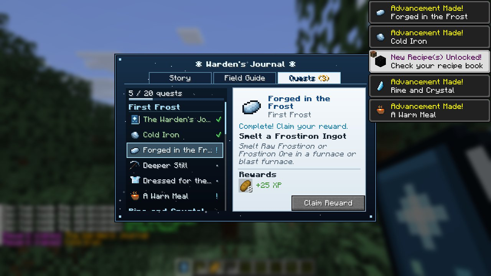
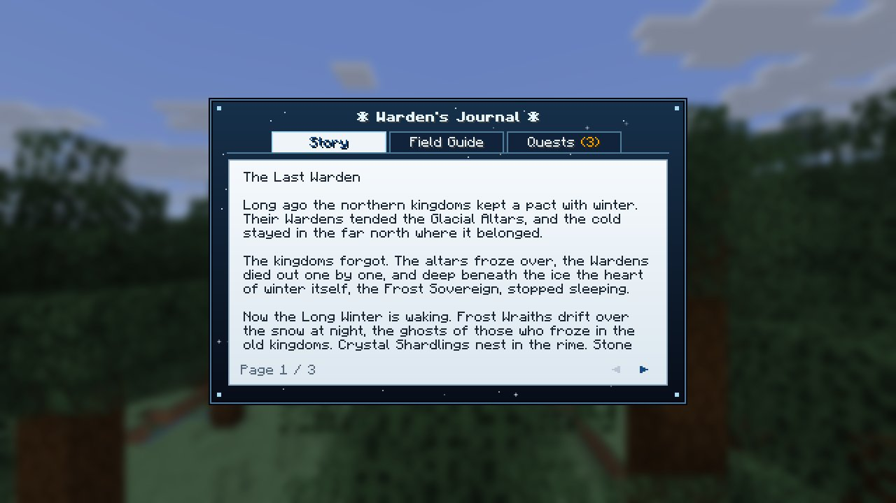
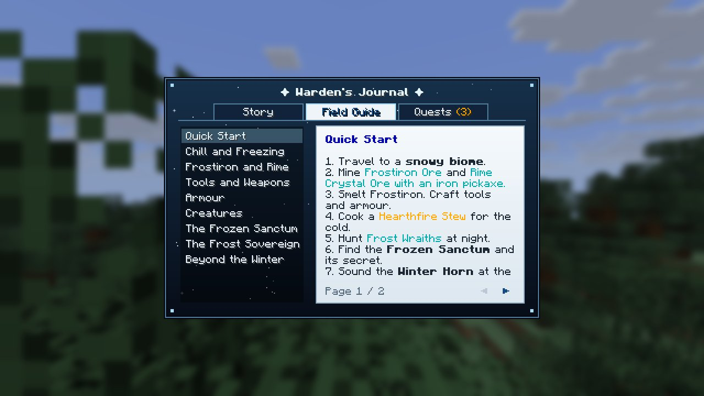
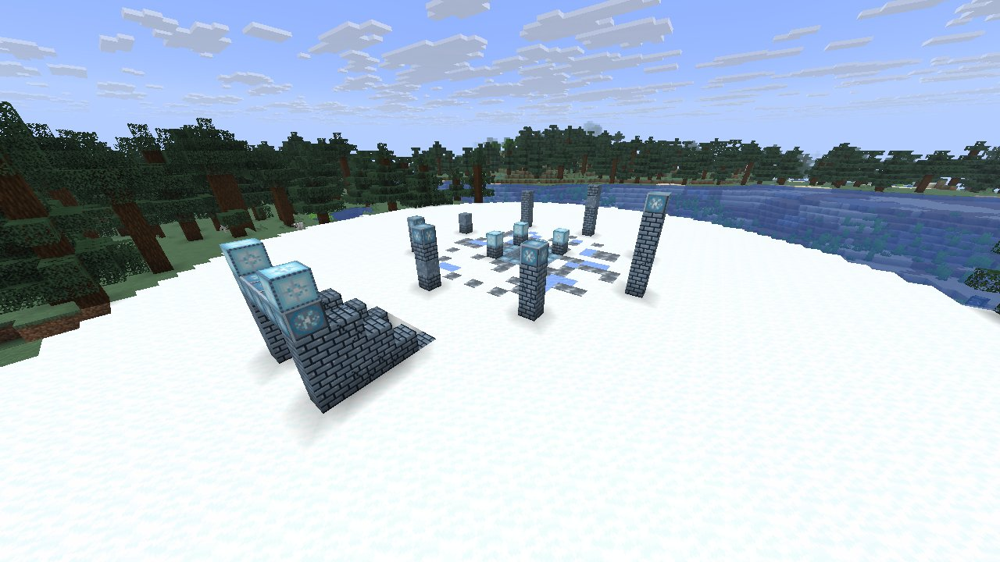
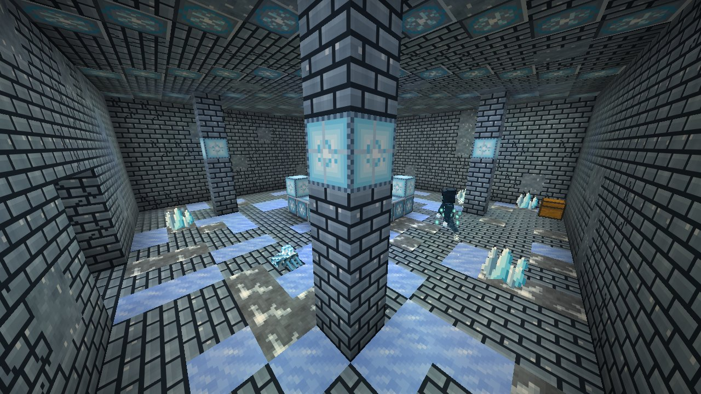
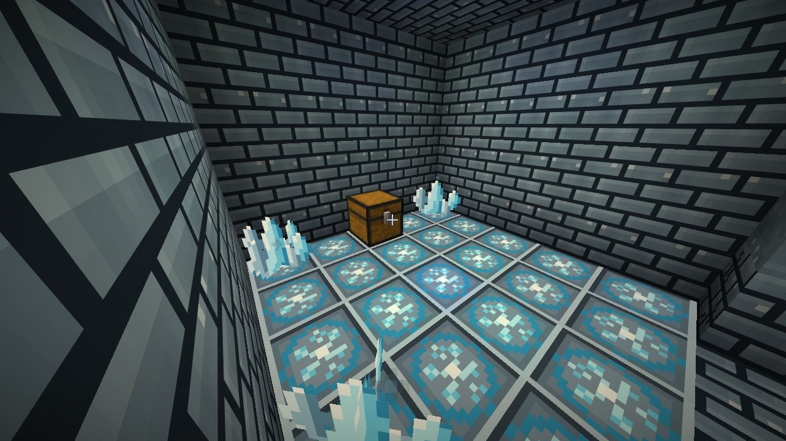
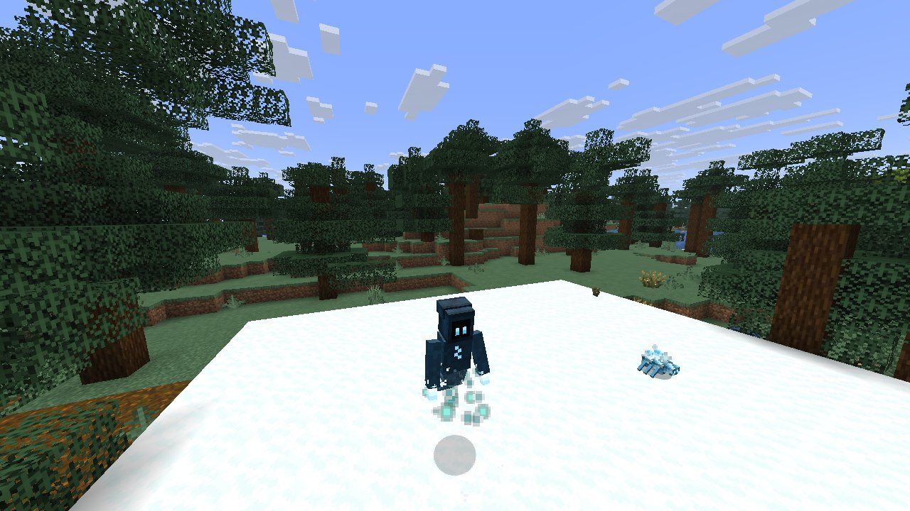
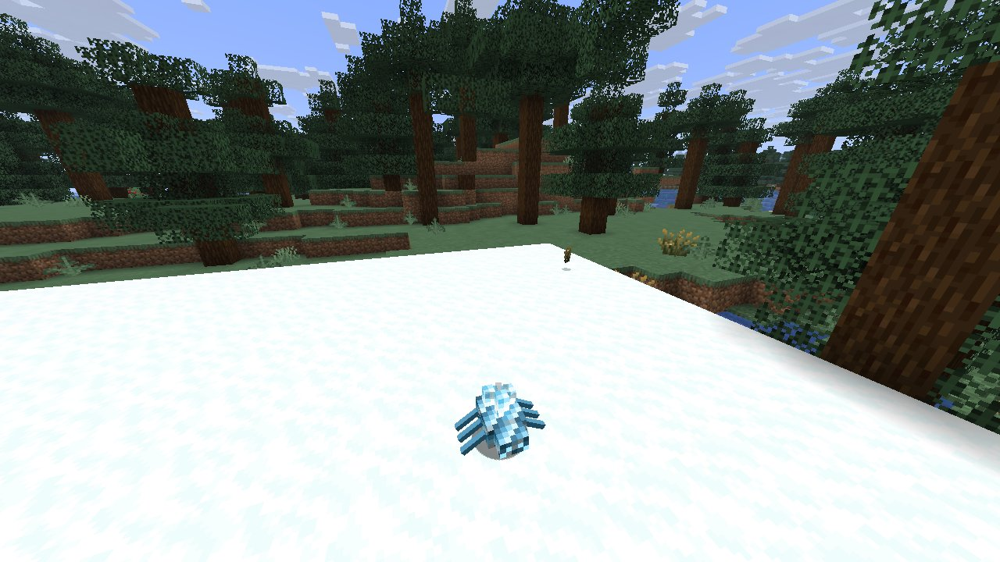
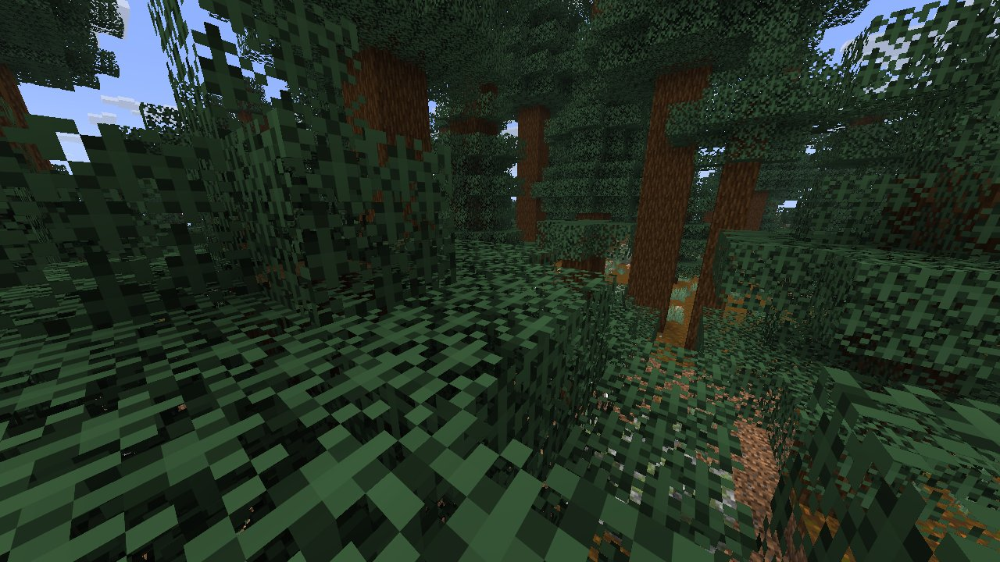
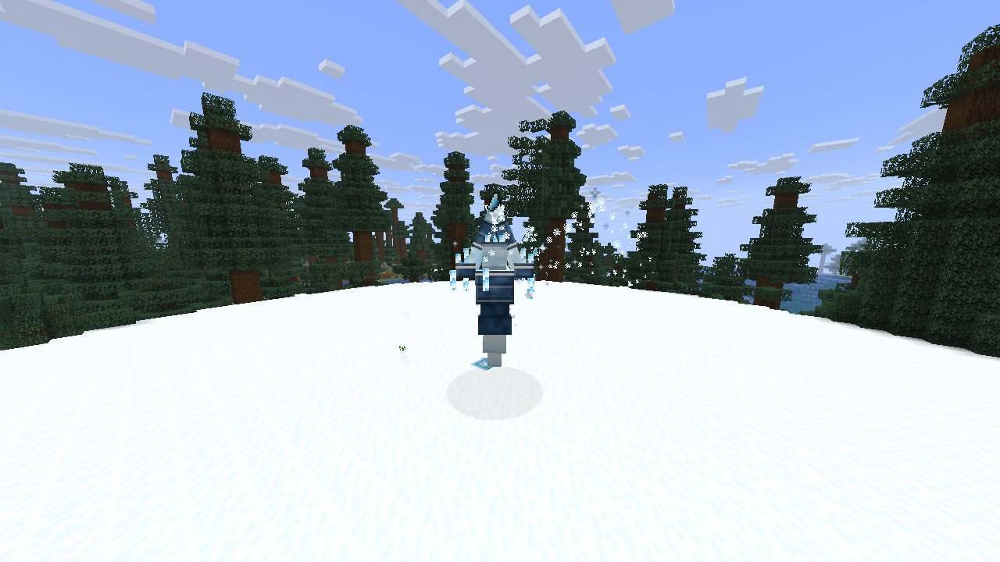

# Rimeheart

**The Long Winter has come.**

Rimeheart is a frost-themed adventure mod for Minecraft Forge. It is built to sit alongside dozens of other mods in a
modpack, so it has a clear progression curve, balanced numbers, and no world griefing. You mine Frostiron and rime
crystal in the frozen north, fight with *chill* (a combat mechanic built on vanilla freezing), hunt Frost Wraiths and
crystal Shardlings, and dig out a buried Frozen Sanctum with a hidden vault. At the end you sound the Winter Horn to
wake the **Frost Sovereign**. The **Warden's Journal** guides you the whole way. It is a custom book GUI with the
story, a field guide and a quest line with claimable rewards.

| | |
|---|---|
| Minecraft | **Java 26.2** |
| Loader | **Forge 65.1.0** (any later 65.x should work) |
| Java | 25 (CurseForge ships it) |
| Dependencies | **None.** One jar, nothing else to install |
| Side | Install on both client and server |

---

## Screenshots

These are real in-game captures from Minecraft 26.2 + Forge 65.1.0, taken automatically by this repository's CI
client test (software rendering, HUD hidden).

| | |
|---|---|
|  |  |
| Warden's Journal: the quest log with claimable rewards | Warden's Journal: the story |
|  |  |
| Warden's Journal: the field guide | The Frozen Sanctum's plaza and Glacial Altar |
|  |  |
| The buried hall | The hidden vault behind the hollow wall |
|  |  |
| Frost Wraith | Shardling |
|  |  |
| The Winter Horn ritual | The Frost Sovereign attacking |

---

## Installing with CurseForge

1. **Get the jar:** `rimeheart-26.2-1.0.0.jar`.
   - It is in this repository's [`dist/`](dist/) folder.
   - Or open **Actions**, pick the latest green **Build & Self-Test** run on branch `claude/brave-mayer-nr7rc8`,
     and download the **`rimeheart-mod-jar`** artifact. GitHub wraps it in a zip, so unzip it first.
2. **Make a profile.** In CurseForge go to *Minecraft → Create Custom Profile*. Pick Minecraft **26.2**, then Forge
   **65.1.0**.
3. **Drop the jar in.** Click the profile's `⋯` menu → *Open Folder*, and put the jar into the `mods` folder.
4. **Play.** Create a world. You receive the **Warden's Journal** on your first tick in the world. Right-click it.

That is the whole install. On a server, put the same jar in the server's `mods` folder.

> **"Experimental Settings" warning:** vanilla flags every mod that adds world generation through data packs.
> Rimeheart adds ores, spawns and the Frozen Sanctum this way. By default the client answers the prompt for you.
> Set `skipExperimentalWarning = false` in `config/rimeheart-common.toml` to see it again. The world is fine either way.

---

## The Warden's Journal (quest book)

The journal is given automatically on first join. You can craft another from a **Book + Rime Shard** or
**Book + Snowball**.

It opens a custom screen with three tabs:

- **Story:** the lore of the Wardens, the Long Winter and the Frost Sovereign.
- **Field Guide:** nine paged chapters: Quick Start, Chill and Freezing, Frostiron and Rime, Tools and Weapons,
  Armour, Creatures, The Frozen Sanctum, The Frost Sovereign, Beyond the Winter.
- **Quests:** 20 quests in 5 chapters (*First Frost → Rime and Crystal → Things in the Snow → The Frozen Sanctum →
  The Long Winter*).
  - Quests unlock in order, and locked quests stay hidden as `? ? ?` until their parent is done.
  - Each quest shows its objective, a "how to" hint, and its rewards (hover an icon for the item tooltip).
  - A **Claim Reward** button turns on once the quest is complete. The tab title shows how many rewards are waiting.

Quest progress is tracked by real advancements, so it also appears in the vanilla advancements screen. Claims are
stored per player and survive relogs. They work on dedicated servers with no extra setup, because the button sends
`/rimejournal claim <quest>`, which needs no permissions and only pays out your own completed quests.

---

## Progression

1. **First Frost.** Travel to a snowy biome. Mine **Frostiron Ore** (needs an iron pickaxe) and smelt it. Craft
   Frostiron tools and armour, and cook a **Hearthfire Stew** to thaw out.
2. **Rime and Crystal.** Collect **Rime Shards** from Rime Crystal Ore. Craft **Frost Charges**, the **Rimebow** and
   the **Glacier Maul**.
3. **Things in the Snow.** Hunt **Frost Wraiths** at night for Wraith Essence. Craft the **Frostbite Blade**,
   **Wraithweave** armour and the **Blizzard Staff**. Watch out for **Shardlings** nesting in crystal clusters.
4. **The Frozen Sanctum.** Find a buried Sanctum under snowy plains or taiga. Search it for the **Glacial Heart**,
   then forge the **Winter Horn**.
5. **The Long Winter.** Sound the horn at a **Glacial Altar** and defeat the **Frost Sovereign**. Reforge its core
   into **Winterfang**.

---

## Content

### Chill (the core mechanic)
Frost weapons fill the target's **vanilla freezing meter**, the same one powder snow uses. Chilled mobs slow down.
Fully frozen mobs shiver, take freeze damage, and take **Shatter** bonus damage from frost blades. Chill wears off
within a few seconds. Any piece of Frostiron or Wraithweave armour makes you immune, just like leather does in vanilla.
Hearthfire Stew thaws you instantly. Winter creatures are immune to chill.

### Weapons and gadgets
| Item | What it does |
|---|---|
| **Frostiron Sword / Pickaxe / Axe / Shovel** | Mid-game tier between iron and diamond (700 durability, iron mining level) |
| **Frostbite Blade** | Hits chill; +30% Shatter damage on frozen foes. Use: **Cold Snap** (chills everything within 4.5 blocks, 12 s cooldown) |
| **Glacier Maul** | Heavy and slow. Use on the ground: **Permafrost Slam**, a ring of ice spikes that launches and freezes enemies (5 s cooldown) |
| **Rimebow** | Fires icicles without arrows. Full draws hit harder and chill more |
| **Blizzard Staff** | Hold to breathe a cone of blizzard for up to 5 s. Light damage, heavy chill |
| **Frost Charge** | Thrown. Chills mobs in a burst and turns nearby water into temporary frosted ice |
| **Winterfang** | Boss-tier blade, about netherite damage. Heavy chill, +40% Shatter. Use: **Absolute Zero** freezes every enemy within 8 blocks (20 s cooldown) |
| **Winter Horn** | Sound it at a Glacial Altar to summon the Frost Sovereign |
| **Hearthfire Stew** | Food. Removes freezing and grants Regeneration |

### Armour
| Set | Stats | Full-set bonus |
|---|---|---|
| **Frostiron** | 16 armour, 0.5 toughness per set (between iron and diamond) | **Glacial Stride:** water freezes underfoot, and melee attackers are chilled |
| **Wraithweave** | 13 armour, high enchantability | **Spectral Step:** speed on snow and ice. **Fade:** below 30% health you turn invisible with Speed II and nearby monsters lose you (90 s cooldown) |

### Creatures
| Creature | Where | Behaviour |
|---|---|---|
| **Frost Wraith** | Snowy biomes at night; Sanctum halls | Flying spirit that circles and casts ice-shard volleys. Fades in sunlight. Drops Wraith Essence and, rarely, a Glacial Heart |
| **Shardling** | Cold caves; bursts out of Rime Crystal Clusters | Fast crystal crawler with a chilling bite. Silk Touch keeps nests asleep |
| **The Frost Sovereign** (boss) | Summoned at a Glacial Altar | 400 HP, boss bar, two phases: Icicle Barrage, telegraphed Glacial Eruptions, Frost Breath, Stomp. At half health it summons Wraiths, erupts three times at once and attacks twice as often |

### World
- **Frostiron Ore**, **Rime Crystal Ore** and large **Rimestone** veins generate only under snowy biomes.
- **The Frozen Sanctum** is a buried temple under snowy plains, taiga, groves, slopes and ice spikes. On the surface
  you see a ring of broken pillars and a stairwell. Below is a hall with the Glacial Altar, supply chests, guardians
  and crystal growths. A **secret vault** sits behind a wall that only looks solid.
- **Blocks:**
  - Rimestone, and Rimestone Bricks in cracked and chiseled variants
  - Permafrost
  - Frost Lamp
  - Blocks of Frostiron and Rime Crystal
  - Rime Crystal Clusters
  - Glacial Altar

### Balance and modpack notes
- **No griefing.** Nothing in Rimeheart breaks terrain or player builds. Frost Charges and Glacial Stride place
  vanilla frosted ice, which melts.
- **Tiers.** Frostiron is iron-plus: it is weaker than diamond and gated to cold biomes. Only the boss weapon
  approaches netherite, and it costs a boss kill.
- **No farms by design.** The Sanctum has no spawners; its guardians are placed once. Glacial Hearts come from the
  Sanctum vault, from the boss, or at a 2% rate from Wraiths killed by a player.
- **Rewards.** Quest rewards are modest supplies (food, torches, a few ingots, golden apples, XP), not gear skips.
- **Tags for pack makers:**
  - `rimeheart:is_frozen` (biomes): where ores and mobs appear
  - `rimeheart:has_structure/frozen_sanctum` (biomes): where Sanctums generate
  - `rimeheart:winter_creatures` (entity types): immune to chill
  - `minecraft:freeze_immune_wearables` (items): includes all Rimeheart armour
- **Recipes.** All recipes are plain JSON, and every recipe unlocks in the recipe book on first join.

### Key recipes
| Result | Ingredients |
|---|---|
| Frostiron Ingot | Smelt or blast Raw Frostiron or Frostiron Ore |
| Frost Charge ×2 | Rime Shard + Snowball + Gunpowder |
| Frostbite Blade | Frostiron Sword surrounded by 3 Rime Shards + 1 Wraith Essence |
| Glacier Maul | 2 Frostiron Ingots around a Block of Rime Crystal, over 2 sticks |
| Rimebow | 2 Frostiron Ingots, 2 Rime Shards, 3 String (bow shape) |
| Blizzard Staff | Block of Rime Crystal, Wraith Essence and a Frostiron Ingot on a diagonal |
| Winter Horn | 2 Wraith Essence, 4 Frostiron Ingots, Glacial Heart |
| Winterfang | Sovereign's Core above a Frostbite Blade |
| Hearthfire Stew | Bowl, Baked Potato, Carrot, Sweet Berries |
| Warden's Journal | Book + Rime Shard, or Book + Snowball |

---

## Commands and config

`/rimeheart` needs permission level 2:

| Command | Effect |
|---|---|
| `/rimeheart kit` | Every weapon, armour set and gadget |
| `/rimeheart build sanctum` | Builds a Frozen Sanctum where you stand |
| `/rimeheart locate sanctum` | Nearest naturally generated Sanctum |
| `/rimeheart summon` | Starts the Winter Horn ritual in front of you |

`config/rimeheart-common.toml`:

| Option | Default | Meaning |
|---|---|---|
| `bossHealthMultiplier` | `1.0` | Scales the Frost Sovereign's health |
| `shardlingAmbushChance` | `20` | % chance that breaking a crystal cluster without Silk Touch releases a Shardling |
| `skipExperimentalWarning` | `true` | Client answers vanilla's "Experimental Settings" prompt automatically |

---

## Building from source

```
./gradlew build          # jar lands in build/libs/
./gradlew runClient      # dev client
./gradlew runServer      # dev server
```

This needs JDK 25 and access to `maven.minecraftforge.net` and Mojang's servers.

All textures, entity models, sounds and JSON are generated by the Python scripts in `tools/`. They need Pillow,
numpy and soundfile:

```
python3 tools/gen_items.py && python3 tools/gen_blocks.py && python3 tools/gen_extra.py
python3 tools/gen_models.py && python3 tools/gen_sounds.py && python3 tools/gen_resources.py
```

**CI** (`.github/workflows/build.yml`) builds the jar and then runs two tests on real Minecraft 26.2:
- A **dedicated-server self-test** (`-Pselftest`):
  - registries, loot, recipes, all quest advancements, ore features and the structure
  - building the Sanctum (altar, hollow wall, chests)
  - creatures and chill
  - Frost Charges freezing water
  - the Shardling ambush
  - the full boss fight through both phases, including the damage cap, death and loot
- A **real client** under a virtual display (`-Pclienttest`), which opens every journal tab and films the Sanctum,
  the creatures and the boss, then saves the screenshots.
