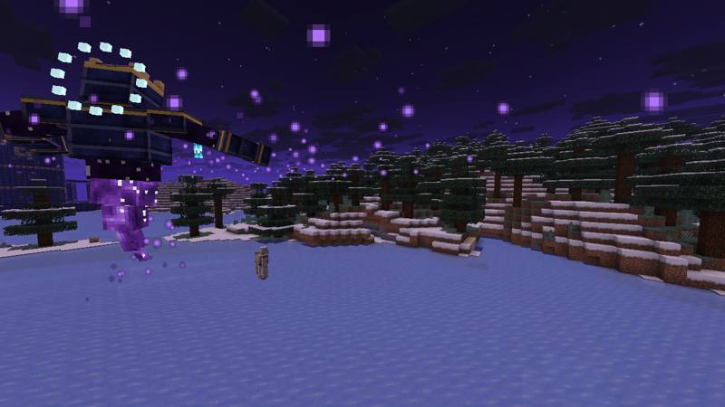
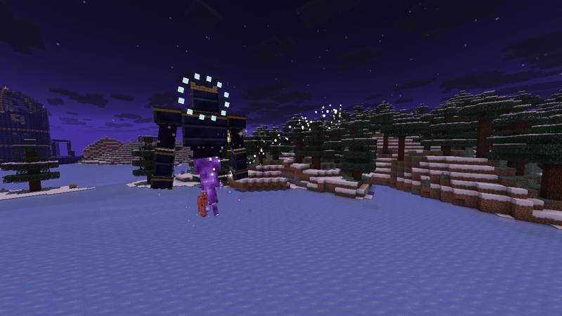
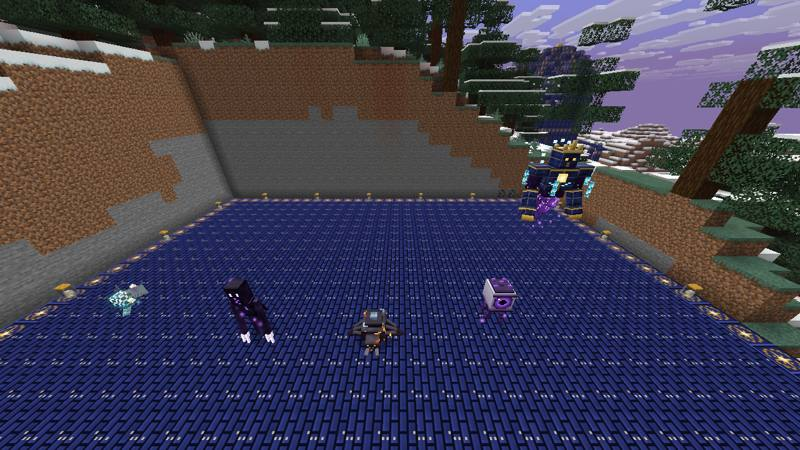
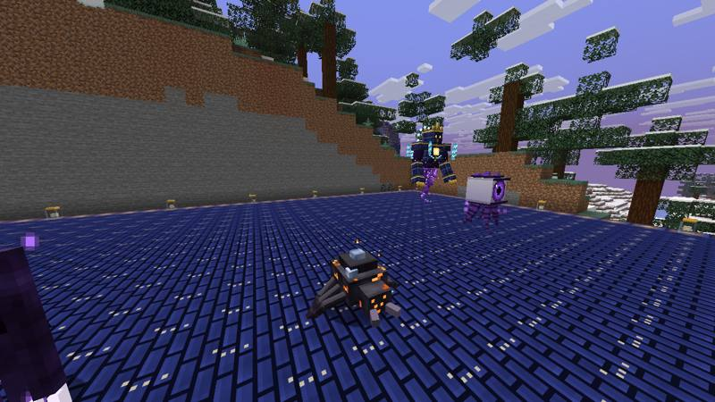
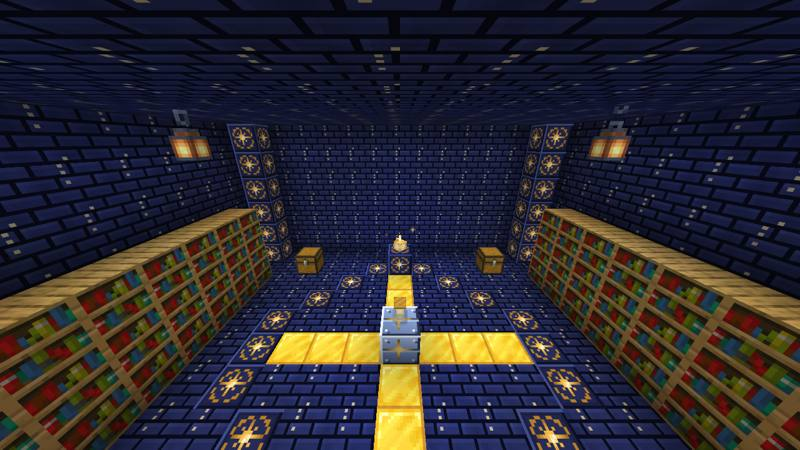
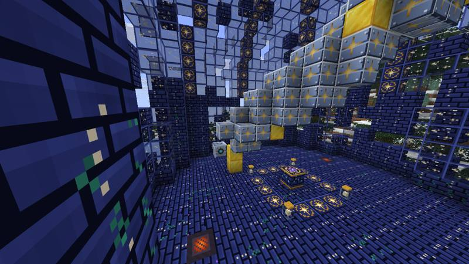
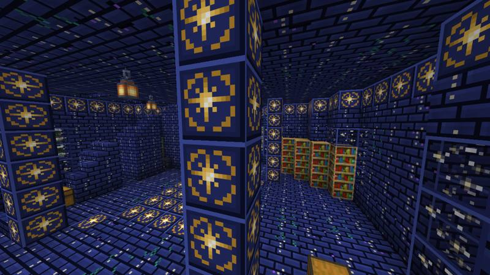
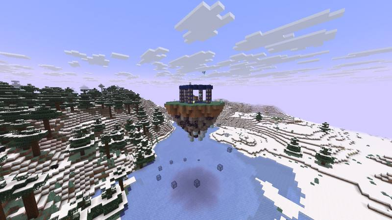
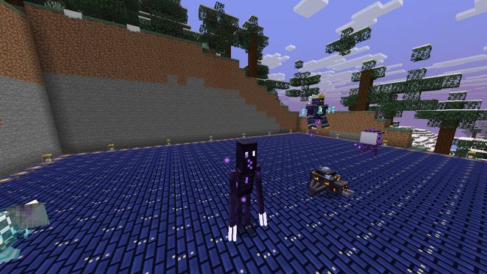
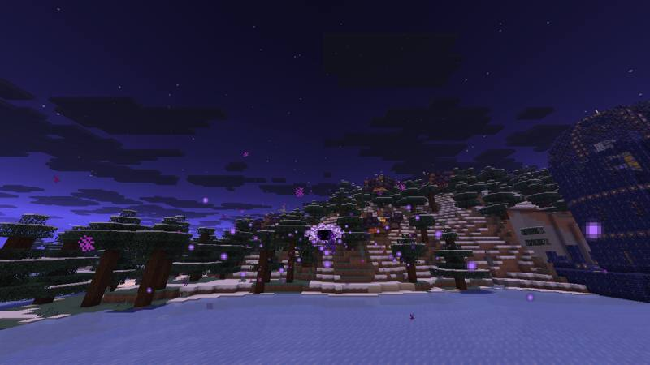

# Astralfall

**The stars are falling, and something followed them down.**

Astralfall is a Minecraft Forge mod about the night sky collapsing onto the world. Meteors crash near
you at night and leave craters full of Starmetal and Skyshards. You forge star weapons, find ruins of an
ancient observatory, tame living starlight, and finally raise an Eclipse to fight **Astraeus, Devourer of
Stars**.

| | |
|---|---|
| Minecraft | **Java 26.2** |
| Loader | **Forge 65.1.0** (recommended build; any later 65.x should work) |
| Java | 25 (CurseForge ships it) |
| Dependencies | **None.** One jar, nothing else to install |
| Side | Needed on both client and server |

---

## Screenshots

These are real in-game captures, taken automatically on Minecraft 26.2 + Forge 65.1.0 by this repo's CI (software
rendering, HUD hidden).

| | |
|---|---|
|  |  |
| **Astraeus, Devourer of Stars** mid-fight | Astraeus attacking a target dummy (set on fire) |
|  |  |
| `/astralfall gallery`: wisp, stalker, crawler, gazer, boss | Meteorite Crawler |
|  |  |
| The sealed **Star Vault** under the Observatory | The shattered telescope chamber and Astral Altar |
|  |  |
| Observatory entrance hall | Sky Shrine floating above a lake |
|  |  |
| Void Stalker | A Riftcaller / grenade singularity at night |

---

## Installing with CurseForge

1. **Get the jar.**
   - Open the repository's **Actions** tab and pick the latest green **Build & Self-Test** run on branch
     `claude/minecraft-youtube-mod-21yi5i`.
   - Scroll to **Artifacts** and download **`astralfall-mod-jar`**. GitHub wraps it in a zip.
   - Unzip it. Inside is `astralfall-26.2-1.0.0.jar`.
2. **Make a profile.** In CurseForge go to *Minecraft → Create Custom Profile*. Pick Minecraft **26.2**,
   then Forge **65.1.0**.
3. **Drop the jar in.** Click the profile's `⋯` menu → *Open Folder* and put `astralfall-26.2-1.0.0.jar`
   into the `mods` folder.
4. **Play.** Create a new world, and you spawn holding the **Astral Journal**.

That is the whole install. No other files are needed.

> **About the "Experimental Settings" warnings**: vanilla flags every mod that adds world generation
> through data packs (Astralfall adds structures and meteor impact sites). You'd normally see a warning
> when creating a world, and "Worlds using Experimental Settings are not supported" when opening a world
> that hasn't confirmed it yet. Astralfall answers both for you automatically, the same as clicking
> "Proceed" / "I Know What I'm Doing!". To get the prompts back, set `skipExperimentalWarning = false` in
> `config/astralfall-common.toml`. If one ever still appears, confirm it. The world is fine.

---

## Filming it fast (showcase mode)

Create a **Creative** world with cheats on. Everything is in the **Astralfall** creative tab. These commands
stage every set piece:

| Command | What happens |
|---|---|
| `/astralfall help` | Lists every command in chat |
| `/astralfall kit` | Every weapon, armour set and gadget, plus grenades, stardust and skyshards |
| `/astralfall starfall 8` | 8 meteors scream in around you and blast craters |
| `/astralfall starstorm` | A full Starstorm with a title card, constant meteors and shooting stars (`stop` ends it) |
| `/astralfall fallenstar` | A golden meteor lands ahead and leaves a Fallen Star under a pillar of light |
| `/astralfall summon` | The Eclipse ritual: the sky goes dark, lightning strikes, the boss meteor falls and **Astraeus** rises |
| `/astralfall gallery` | Builds a lit display stage in front of you and lines up every creature (and the boss) facing the camera |
| `/astralfall build observatory` | Builds the Shattered Observatory in front of you. Also works with `fallen_vessel`, `sky_shrine` and `crater` |
| `/astralfall locate observatory` | Distance and coordinates of the nearest naturally generated one |

Tips for filming:
- Run `/time set midnight` before `starfall` or `starstorm`. Meteors look best at night.
- `F1` hides the HUD.
- For the boss fight, build or pick open ground with a few pillars. The Star Lance sweeps the whole arena.

---

## The journey: basics to endgame

Your **Astral Journal** walks you through all of this, with a clickable table of contents. The
**Astralfall** tab in the Advancements screen (`L`) tracks 26 quests with XP and item rewards. If you lose
the journal, craft **Book + Gold Nugget** (or Book + Stardust).

1. **Watch the sky.** At night meteors crash near players. Run to the crater before it cools.
2. **Starmetal.** Mine Meteorite, Starmetal Ore and Skyshard Clusters with an iron pickaxe. Smelt Raw
   Starmetal into ingots, and craft a Skyshard into 2 Stardust.
3. **First gear.** Make the Starmetal Pickaxe (mines 3×3), the Starblade and Starmetal armour.
4. **Explore.** The Astral Compass points to the three structure types and draws a trail of stars to them.
5. **Creatures.** Tame an Astral Wisp. Survive Void Stalkers, Meteorite Crawlers and Void Gazers, whose
   Void Essence makes the Voidwalker armour and the Riftcaller.
6. **Secrets.** Open the Observatory's Star Lock with a Skyshard to reach the sealed Vault and its
   Constellation Bow. Look through the telescope at night. Loot the Fallen Vessel for the Gravity Gauntlet.
7. **Fallen Stars.** Rare golden meteors leave Fallen Star Shards, the key to the Eclipse Sigil.
8. **The Eclipse.** Use the Sigil on an Astral Altar. Astraeus fights in three phases.
9. **Beyond.** Its Stellar Core becomes the Eclipse Greatsword and the Nebula Wings. It also drops the
   Crown of Astraeus.

---

## Content

### Weapons and gadgets
| Item | Ability |
|---|---|
| **Starblade** | Right-click fires a piercing Star Slash crescent. Sneak + use to Starlight Dash through enemies. +50% damage vs void creatures |
| **Comet Maul** | Hold, aim and release to call a meteor down where you look. Sneak + use for a Ground Slam shockwave |
| **Riftcaller** (scythe) | Opens a black hole where you aim that pulls mobs in, then collapses. Hits steal life |
| **Constellation Bow** | Needs no arrows. A full draw fires 5 homing stars that seek hostile mobs. Found in the Observatory Vault |
| **Eclipse Greatsword** | Hits charge the Eclipse and set foes on fire. At 12 charge, right-click to release the **Eclipse Nova** |
| **Gravity Gauntlet** | Hold on a mob to lift it, release to hurl it. Sneak on a block to rip it out and throw it |
| **Singularity Grenade** | Thrown. Opens a short-lived black hole that ends in a shockwave |
| **Starmetal Pickaxe** | Mines 3×3; sneak to mine a single block |
| **Astral Compass** | Locates the Observatory, Vessel or Shrine and shows a star trail. Sneak + use to switch target |

### Armour
| Set | Full-set bonus |
|---|---|
| **Starmetal** | No fall damage. Landing from high up releases a **Meteor Landing** shockwave |
| **Voidwalker** | Night vision. Void Stalkers ignore you. **Sneak in mid-air** to blink forward |
| **Crown of Astraeus** | Rains golden stars on nearby monsters and gives night vision (boss drop) |
| **Nebula Wings** | Glide like an elytra with a nebula trail. **Sneak mid-glide for a Nebula Boost** (a firework-free burst of speed, 4 s cooldown). Double elytra durability, repaired with Void Essence |

### Creatures
| Creature | Behaviour |
|---|---|
| **Astral Wisp** | Floats near fallen stars. Feed it Stardust to tame it; it follows you, heals you and shoots gold stars at your enemies. 1 in 30 are **Prismatic** |
| **Void Stalker** | Frozen while you look at it. Look away and it runs at you. Ignore it too long and it blinks **behind you** |
| **Meteorite Crawler** | Curls into a boulder and rolls at you. Dodge so it hits a wall: it is stunned and takes double damage |
| **Void Gazer** | A floating eye that charges for two seconds and fires a gravity beam that throws you skyward. Break line of sight |

### Boss: Astraeus, Devourer of Stars
- **Entrance.** The Eclipse ritual turns night instantly, strikes lightning, drops a boss meteor and brings
  Astraeus up out of the crater, with a title card and boss bar.
- **Phase 1:**
  - Meteor Rain
  - a sweeping Star Lance beam
  - homing Crystal Shard barrages
  - Gravity Collapse, which pulls you in and then explodes
  - Slam
- **Phase 2 (50% health):** summons stalkers and gazers, and opens black holes under you.
- **Phase 3 (20% health):** the sky falls. Meteors never stop and every attack gets faster.
- **Rewards:**
  - Stellar Core
  - Eclipse Greatsword
  - Crown of Astraeus
  - a pile of Starmetal and Skyshards
- **Victory:** the sun rises.

### Structures
| Structure | Where | Secrets |
|---|---|---|
| **Shattered Observatory** (large) | Overworld, rare | A meteor-split tower with a telescope chamber on top (the eyepiece pulls a star out of the night sky), an Astral Altar, Gravity Rune and Starfire Vent traps, and a hidden **Star Vault** under the entrance hall that opens with a Skyshard |
| **Fallen Vessel** | Overworld | A crashed ship half-buried in its own trench. A crawler-infested reactor and holds with gravity tech |
| **Sky Shrine** | High above the Overworld | A floating island shrine holding flight gear |
| **Impact Sites** | Plains, forests, taiga, savanna, desert, badlands, meadows | Old meteor craters with ore and meteorite |

### World events
- **Meteor showers:** natural meteor strikes near players at night, which carve craters.
- **Starstorms:** about 1 in 7 nights. Meteors every few seconds and shooting stars across the sky.
- **Fallen Stars:** rare golden meteors marked by a pillar of light that can be seen from far away.

### Building blocks
- Astral Bricks, in cracked, overgrown, chiseled, stairs and slab variants
- Astral Glass
- Meteorite and Meteorite Bricks
- Void Stone
- Starmetal and Skyshard blocks
- Star Jars (bottled starlight lamps)
- Gravity Runes and Starfire Vents, which you can craft as traps

### Recipes (key ones)
Every recipe unlocks in the recipe book when you join, and the journal covers them too.

| Result | Ingredients |
|---|---|
| Starmetal Ingot | Smelt or blast Raw Starmetal or Starmetal Ore |
| Stardust ×2 | 1 Skyshard (shapeless) |
| Starblade | Skyshard over Starmetal Ingot over Stick |
| Starmetal Pickaxe | 3 Starmetal Ingots + 2 Sticks (pickaxe shape) |
| Comet Maul | 2 Meteorite + Block of Starmetal on top, 2 Sticks below |
| Riftcaller | 3 Void Essence + 1 Starmetal Ingot + 2 Sticks |
| Gravity Gauntlet | 5 Starmetal Ingots + Void Essence + Skyshard |
| Singularity Grenade ×2 | 3 Starmetal Nuggets + Void Essence + Gunpowder |
| Astral Compass | Compass surrounded by 4 Skyshards |
| Eclipse Sigil | 4 Void Essence + 4 Skyshards around a Fallen Star Shard |
| Astral Altar | 2 Skyshards, a Block of Starmetal and 5 Chiseled Astral Bricks |
| Eclipse Greatsword | Fallen Star Shard over Stellar Core over Starblade |
| Nebula Wings | Stellar Core + 4 Void Essence + 2 Phantom Membrane + 1 Skyshard |
| Astral Journal | Book + Gold Nugget, or Book + Stardust |

---

## Config

`config/astralfall-common.toml`:

| Option | Default | Meaning |
|---|---|---|
| `meteorShowers` | `true` | Natural meteors at night |
| `meteorChance` | `2400` | Per player per night tick, a 1-in-N chance of a nearby meteor (lower means more) |
| `starstormChance` | `7` | 1 in N nights becomes a Starstorm (0 turns them off) |
| `meteorCraters` | `true` | Meteors carve craters. They never break blocks that have block entities |
| `bossHealthMultiplier` | `1.0` | Scales Astraeus' health |
| `skipExperimentalWarning` | `true` | Answers vanilla's "Experimental Settings" prompt for you on world load and creation |

---

## Video beat sheet

1. **Cold open:** `/astralfall starstorm` at midnight, filmed from a hilltop.
2. **Mine the crater.** Show the glowing ores and the 3×3 pickaxe.
3. **Weapon montage:**
   - Starblade dash through a crowd
   - Comet Maul meteor
   - Riftcaller black hole
   - Gravity Gauntlet throwing a cow
   - Constellation Bow homing stars
4. **Creatures:**
   - the Void Stalker "don't look away" bit
   - a Crawler slamming into a wall
   - a Gazer launching you into the sky
   - taming a Wisp (hunt for a Prismatic one)
5. **Observatory tour:**
   - the Gravity Rune trap
   - the Star Lock opening the Vault
   - the telescope pulling down a star
6. **The Eclipse:** the full ritual entrance, then all three boss phases.
7. **Victory at sunrise.** Show the Greatsword's Eclipse Nova, then fly out on Nebula Wings wearing the Crown.

---

## Building from source

```
./gradlew build          # jar lands in build/libs/
./gradlew runClient      # dev client
./gradlew runServer      # dev server
```

It needs JDK 25 and access to `maven.minecraftforge.net` and Mojang's servers.

**Asset pipeline.** All textures, models, sounds and JSON are generated by the Python scripts in `tools/`,
which need Pillow and numpy:

```
python3 tools/gen_blocks.py && python3 tools/gen_items.py && python3 tools/gen_models.py
python3 tools/gen_extra.py && python3 tools/gen_sounds.py && python3 tools/gen_resources.py
```

**CI** (`.github/workflows/build.yml`) builds the jar and then runs two automated tests on real Minecraft 26.2:
- **Dedicated-server self-test** (`-Pselftest`), which checks:
  - registries, loot tables, recipes, advancements and structures
  - building every structure
  - the Star Lock
  - every creature and weapon entity
  - meteors and craters
  - a full scripted boss fight through all three phases, including the loot drop
- **Real client** under a virtual display (`-Pclienttest`), which renders every showcase scene and saves
  screenshots, uploaded as the `screenshots` artifact.
