# Oathbound: The Hollow Crown

**The Order of the Ember Lantern fell in a single night. You are its last squire.**

Oathbound is a medieval-fantasy adventure mod for Minecraft Forge. It follows a six-chapter story across purpose-built
structures, puzzles and boss fights, and ends in a dimension of its own. It also fills the wider world with creatures,
places, materials and relics that have nothing to do with the story. It adds no dependencies and no world griefing,
and it is tuned to sit alongside other mods as the core of a modpack.

| | |
|---|---|
| Minecraft | **Java 26.2** |
| Loader | **Forge 65.1.0** (later 65.x builds should also work) |
| Java | 25 (CurseForge ships it) |
| Dependencies | **None.** One jar |
| Side | Install on both client and server |

---

## Installing with CurseForge

1. **Get the jar:** `oathbound-26.2-1.0.0.jar`.
   - It is in this repository's [`dist/`](dist/) folder. CI publishes it there only after the build, the server
     self-test and the client test have all passed.
   - Or open **Actions**, pick the latest green **Build & Self-Test** run, and download the mod-jar artifact.
     GitHub wraps it in a zip, so unzip it first.
2. **Make a profile.** In CurseForge go to *Minecraft → Create Custom Profile*. Pick Minecraft **26.2**, then Forge
   **65.1.0**.
3. **Drop the jar in.** Click the profile's `⋯` menu → *Open Folder* and put the jar in the `mods` folder.
4. **Play.** Create a new world. On your first join you receive the **Lantern Chronicle**. Right-click it.

For a server, put the same jar in the server's `mods` folder.

> **"Experimental Settings" prompt.** Vanilla shows this for every mod that adds world generation through data packs.
> Oathbound adds its structures, ores and spawns that way. The client answers the prompt for you. To see it again, set
> `skipExperimentalWarning = false` in `config/oathbound-common.toml`. Your world is fine either way.

> **Use a new world.** The structures, ores and creatures only generate in chunks that did not exist before you
> installed the mod.

---

## Screenshots

These are real in-game captures from Minecraft 26.2 + Forge 65.1.0. The repository's CI client test takes them
automatically on every build, using software rendering with the HUD hidden. They are refreshed in
[`docs/oathbound/ci/`](docs/oathbound/ci/) after each green run.

| | |
|---|---|
| 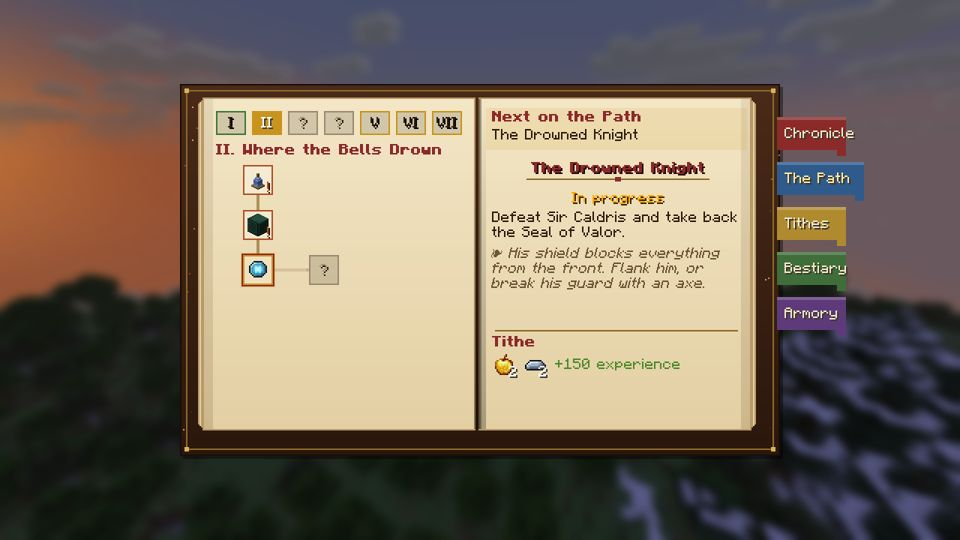 | 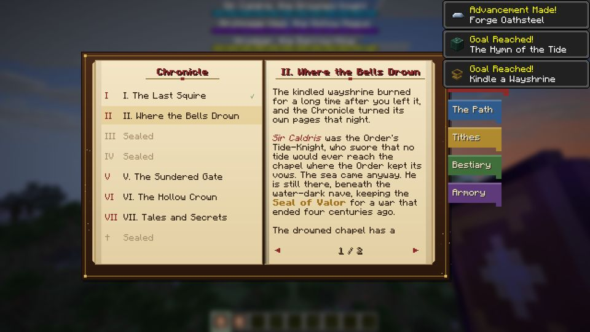 |
| The Lantern Chronicle: the Path of quests | The Lantern Chronicle: the story |
| 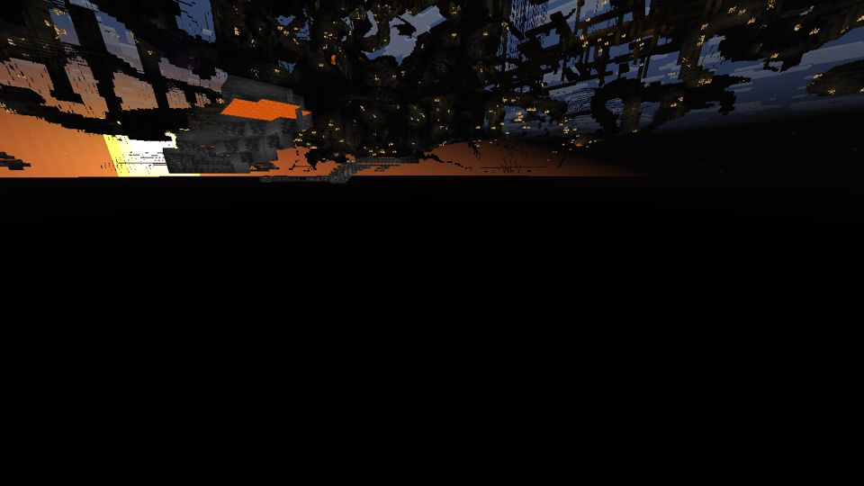 | 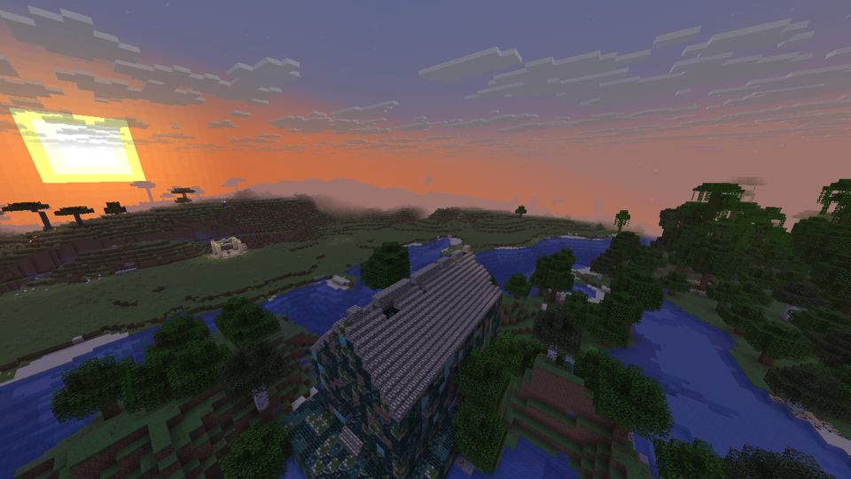 |
| A Wayshrine | The Drowned Chapel |
|  | 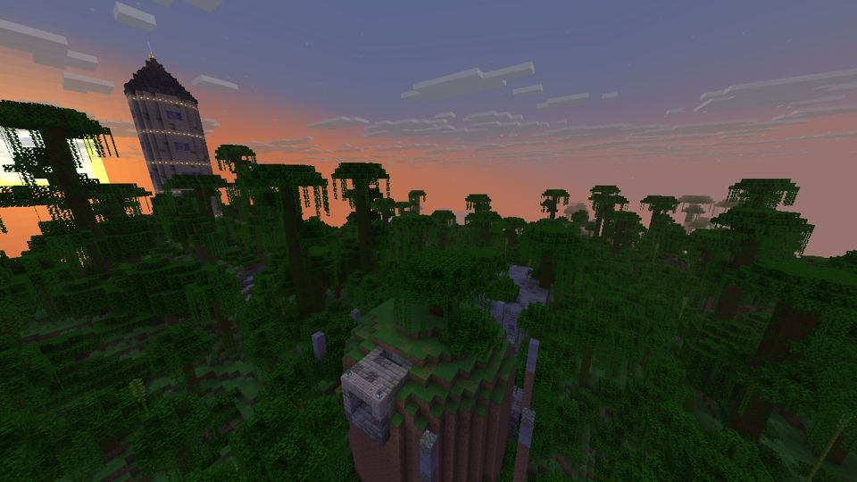 |
| The Arcanist's Spire | The Barrow of Kings |
| 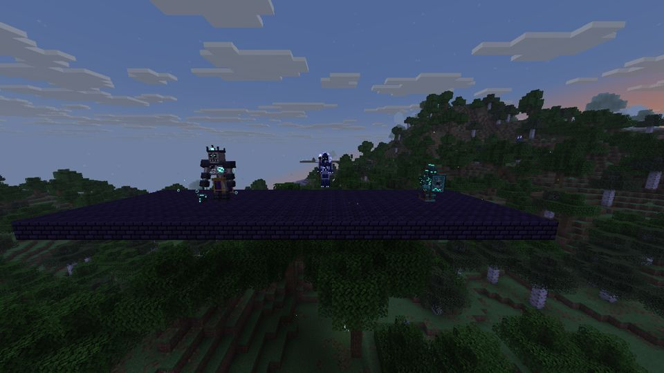 | 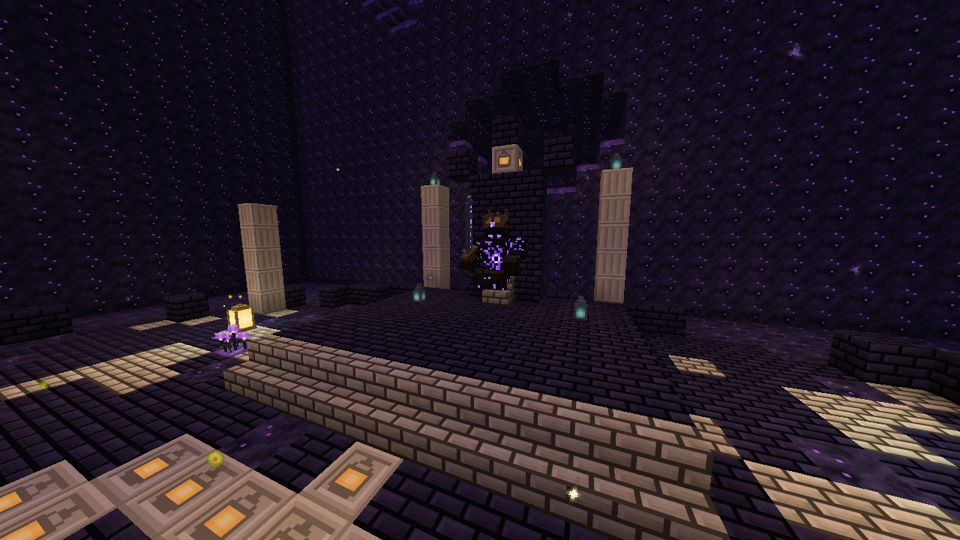 |
| The three seal keepers | Morvane, the Hollow King |
| 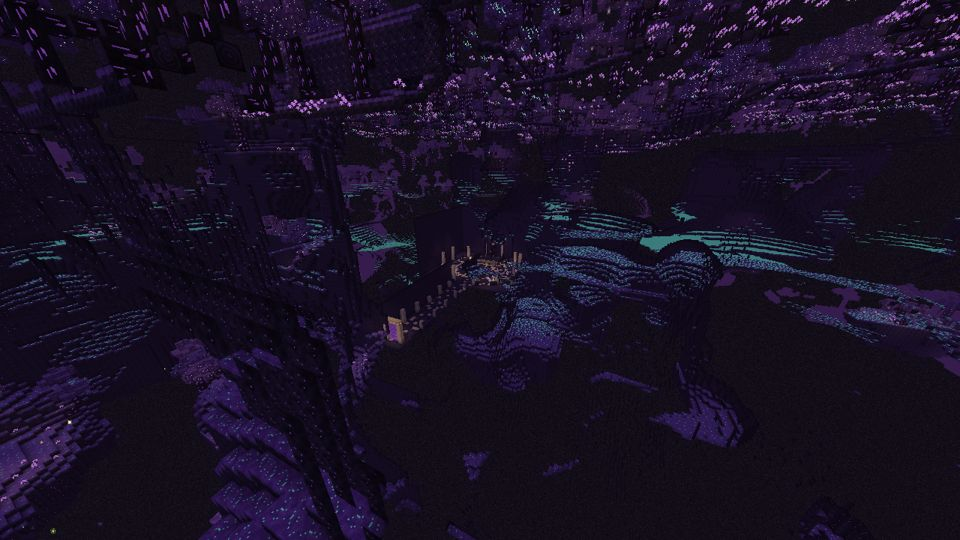 |  |
| The Gloaming | Spell marks |
| 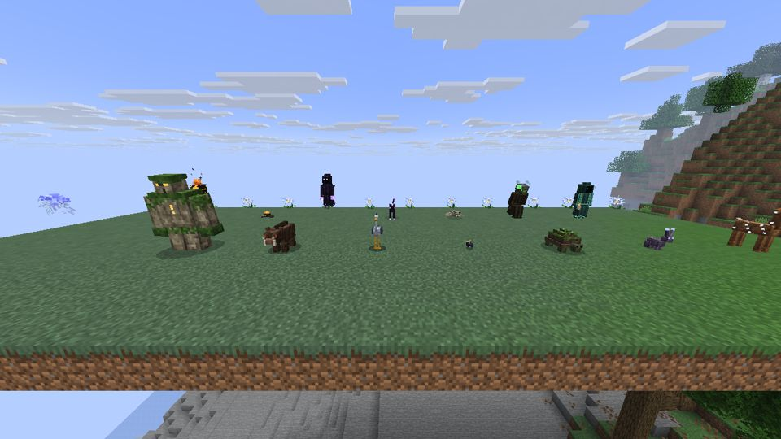 | 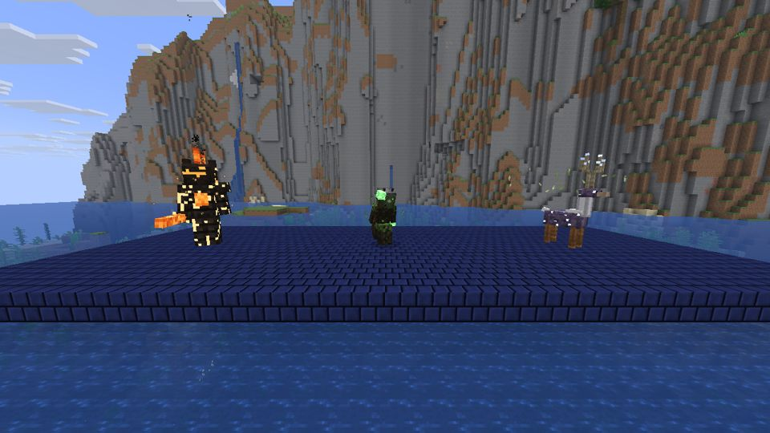 |
| The wider roster | The Elderhorn, the Bog Mother and the Cinder Colossus |
| 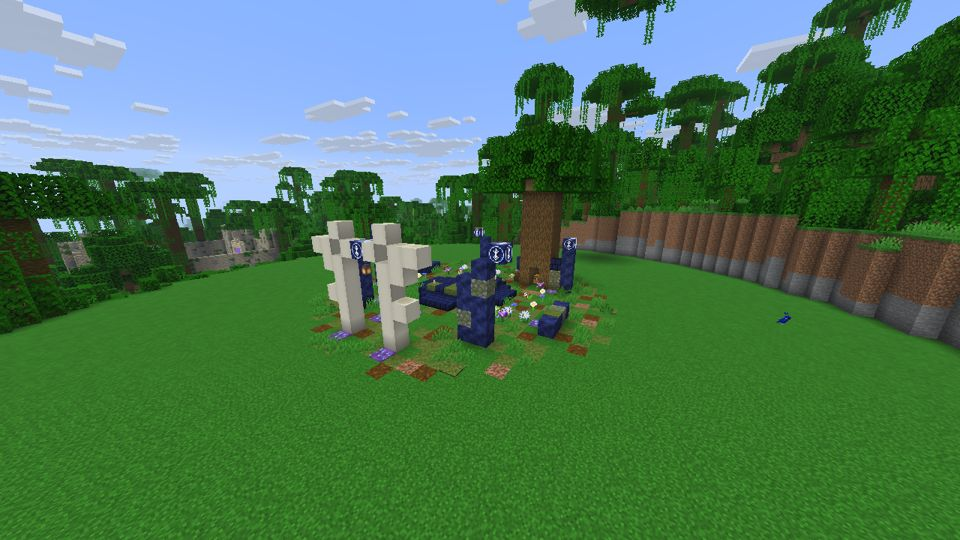 | 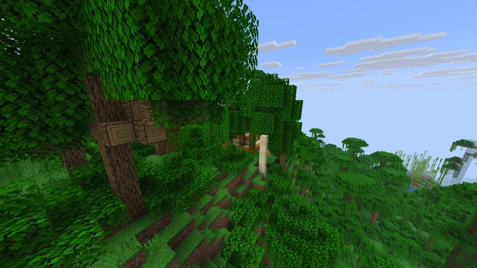 |
| The Stag's Ring | The Cinder Sanctum |
| 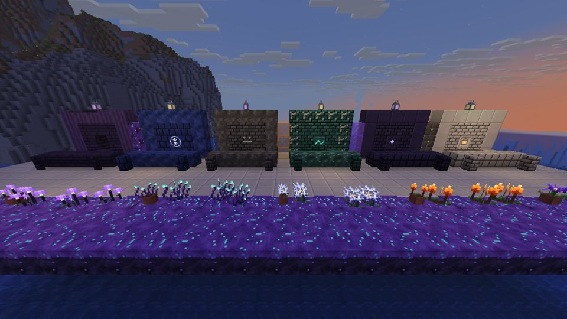 | 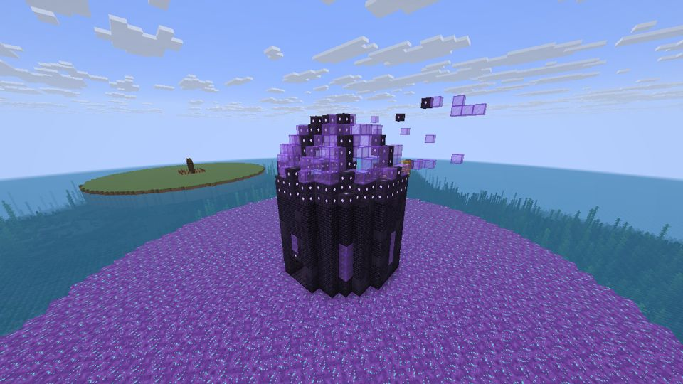 |
| Building families | The Shattered Observatory |

---

## The story

The **Lanternguard** were knight-wizards who carried the **Everflame**, a fire kindled at the first dawn. Their
Lord-Commander **Morvane** feared death. In the **Gloaming**, the grey country between dusk and night, he found the
**Hollow Crown**, swore on it, and lied. The Gloam poured through him, and the Order fell in a single night. Three of
its greatest sealed him beyond the **Sundered Gate**, each binding one **Oath Seal** with their own life. After four
hundred years the seals are failing, and they have hollowed out the knights who hold them.

| Chapter | Where | What you do |
|---|---|---|
| I. The Last Squire | anywhere | Mine **lumenite**, forge **oathsteel**, make a **Warden's Lantern** and kindle a **Wayshrine** |
| II. Where the Bells Drown | the **Drowned Chapel** (swamps, rivers, beaches) | Ring the bells in the right order to raise the crypt grate; face **Sir Caldris** for the **Seal of Valor** |
| III. The Hollow Spire | the **Arcanist's Spire** (forests, taiga, meadows) | Answer four riddles on the rune dials to dissolve the ward; face **Archmage Veyl** for the **Seal of Wisdom** |
| IV. The Barrow of Kings | the **Barrow** (plains, taiga, hills) | Read the epitaphs and open only the honest king's tomb; face **Hrodgar** for the **Seal of Sacrifice** |
| V. The Sundered Gate | the **Sundered Citadel** (rare) | Bind the three seals into the **Oathkey** and open the Gate |
| VI. The Hollow Crown | the **Gloaming** | Survive **Gloamrot** with a lit lantern, reach the Hollow Throne and break **Morvane** |

Your **Warden's Lantern** can *Seek*: use it and it points toward the Chronicle's next destination.

**Morvane** fights in three phases. As the **Oathbreaker** he uses sword combos, a lunge and a counter-stance that
arrows can break. As the **Hollow Sorcerer** he levitates, fires orbiting blades, erupts marked ground and calls
Forsworn knights. As **the Hollow** the arena goes dark and he cannot be touched until you relight the four Ward
Lanterns. His rewards are **Dawnbreaker**, the **Hollow Crown** and **Everflame Embers**.

---

## The Lantern Chronicle

The Chronicle is given on first join. It is a custom book with five tabs:

- **Story:** the chapters of the fall of the Order. Each chapter unseals as you reach it.
- **The Path:** every chapter's quests, drawn as a branching path of seals, with an objective and a hint for each.
  Chapter VII, *Tales and Secrets*, holds the side quests: the wild keepers, the off-Path sites, the lore tablets and
  more.
- **Tithes:** rewards for finished quests. The Order pays at any kindled Wayshrine, so warm your hands at one to
  collect.
- **Bestiary:** every creature, with notes on how to fight it. Entries fill in as you progress.
- **Armory:** the Order's arms, the five metals' signature blades and the relics.

When you finish a chapter's main quests you may swear one of three permanent **Oath Boons** for it: extra health,
reach, faster cooldowns, Gloamrot immunity and others.

Quest progress is tracked with real advancements, so it also appears on the vanilla advancements screen. It works on
dedicated servers with no setup.

---

## Beyond the Path

### The wild keepers and seven places off the Path

| Site | Where | What waits there |
|---|---|---|
| **The Stag's Ring** | flower, birch and old-growth forests, cherry groves | **Elderhorn, the Grove King**. He gore-charges and staggers if he hits stone, calls roots up under you, bellows a storm of leaves, and kneels to heal until you hit him hard. Drops the **Grove King's Crown**. |
| **The Bog Mother's stilt-house** | swamps | **The Bog Mother**. She throws witch-fire, turns ground into poisonous bog, blinks away from blades, and raises a brood of bone-children that shields her while it lives. Drops the **Bog Mother's Lantern**. |
| **The Cinder Sanctum** | deserts and badlands | **The Cinder Colossus**, in a magma hall under a sun-cult pyramid. It cuts burning lines, erupts the ground under you, and vents from its chest, which leaves its core open to double damage. It turns molten when wounded and cracks when wet. Drops the **Cinder Heart**. |
| **The Last Watch** | windswept hills, meadows, plains | A Lanternguard watchtower with a signal fire, and a stonewarden at the door |
| **The Tideglass Grotto** | beaches and stony shores | A crystal-lit sea cave with the drowned choir's shrine and a wrecked rowboat |
| **The Lumenite Delve** | under forests, taiga, hills and plains | A headframe over a 30-block shaft into timbered galleries, a flooded sump and a vein chamber full of mites |
| **The Shattered Observatory** | the Gloaming's islands | A star-readers' tower with its dome blown open; the telescope still aims at the breach |

### Creatures

Twenty-one creatures roam the world, besides the bosses and the spectral housecarls they summon:

- **Passive:** glimmerfawn, duskhare, mossback tortoise, lumen beetle, tidewader, lanternmoth.
- **Neutral:** thornback boar (the whole sounder charges when one is struck), stonewarden (hunts monsters), runewisp.
- **Hostile:** gloamling, veilhound, Forsworn knight, barrow wight, animated tome, drowned choirmonk, mire hag,
  grave crawler, gloam stalker, shade wraith, lumenite mite, ashen revenant.

Each has its own model, animations, voice and drops. Several have a mechanic to learn: the Forsworn only stay down
when killed with fire or oathsteel, gloam stalkers show plainly only in lantern light, revenants falter in the rain,
and mites drink your lantern's oil.

### Materials, gear and relics

- **Five metals:** tidebronze, runesilver, gravegold, duskiron and dawnsteel. Each has a full tool and armour set with
  a set bonus, plus a signature weapon: gladius, rapier, khopesh, glaive and greatsword.
- **Oathsteel arms:** longsword (Riposte), Warden's Halberd, Dawnstring Longbow, Shadowreap Sickle, the Drowned
  Anchor, the Staff of Veyl, the Housecarl's Warhorn and Dawnbreaker.
- **Ten relics**, each with its own power and cooldown: the Huntsman's Horn, Bell of the Drowned, Veyl's Mirror, Barrow
  Censer, Lanternguard Signet, Grove King's Crown, Bog Mother's Lantern, Cinder Heart, Heart of the Gloam and
  Sunshard Talisman.
- **Hearth food and elixirs:** pies, stews, teas, duskwine, and five elixirs (tides, wards, shrouds, the wayfarer,
  valor).
- **Building families:** wardstone, gloamstone, tidestone, barrowstone and runestone, each with stairs, slabs and
  walls; gloamwood with a full wood set; lamps, glass, bars, lanterns, metal blocks; and five flowers.
- **Lore:** ten engraved tablets in the story structures, and nineteen torn pages scattered through chests.
- **Music:** four discs, plus battle themes for the keepers, the wild keepers and the Hollow King.

---

## Configuration

`config/oathbound-common.toml`:

| Option | Default | What it does |
|---|---|---|
| `giveChronicleOnFirstJoin` | `true` | Give each player the Lantern Chronicle on first join |
| `keeperHealthMultiplier` | `1.0` | Health multiplier for the seal keepers and the wild keepers |
| `bossHealthMultiplier` | `1.0` | Health multiplier for Morvane (useful on multiplayer servers) |
| `gloamrot` | `true` | The Gloaming withers players who carry no lit lantern |
| `lanternLight` | `true` | A held Warden's Lantern lights the area around you |
| `skipExperimentalWarning` | `true` | Client: answer vanilla's "Experimental Settings" prompt automatically |

Structure spacing, biomes and spawns are ordinary data-pack files under `data/oathbound/`
(`worldgen/structure_set`, the `has_structure/*` biome tags and `forge/biome_modifier`), so a modpack can retune
them with a data pack.

## Commands

The `/oathbound` commands need operator permission (level 2). They are meant for testing and for pack makers.

| Command | What it does |
|---|---|
| `/oathbound kit` | The gear of a knight who has walked the whole Path |
| `/oathbound build <structure>` | Build any structure at your feet |
| `/oathbound keeper <name>` | Summon a seal keeper, a wild keeper or Morvane |
| `/oathbound stage <quest>` | Complete the Path up to a quest |
| `/oathbound locate <structure>` | Find the nearest site of that kind |
| `/oathbound gate` | Open the nearest Sundered Gate |
| `/oathbound gloaming` / `home` | Travel to the Hollow Throne and back |

---

## Building from source

```
./gradlew build          # the jar lands in build/libs/
```

Every texture, model, sound, piece of music, language string and data file is generated by the Python toolchain in
[`tools/oath/`](tools/oath/) (NumPy, Pillow and SoundFile), and the results are committed. For example,
`python3 -m tools.oath.data` rewrites the data pack and `python3 -m tools.oath.lang` rewrites the English strings.

The GitHub Actions workflow does the following on every push:

1. Builds the jar.
2. Runs a dedicated-server self-test. It builds every structure, solves every puzzle, spawns every creature, and
   fights every keeper, every wild keeper and all three phases of Morvane.
3. Runs a real client under Xvfb and takes the screenshots above.
4. If everything passes, publishes the tested jar to `dist/`.

## License

MIT.
