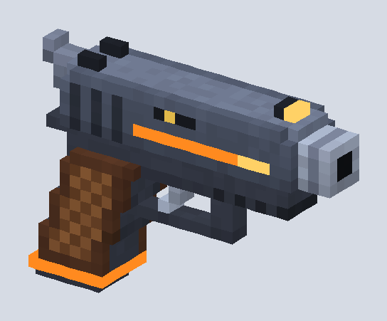
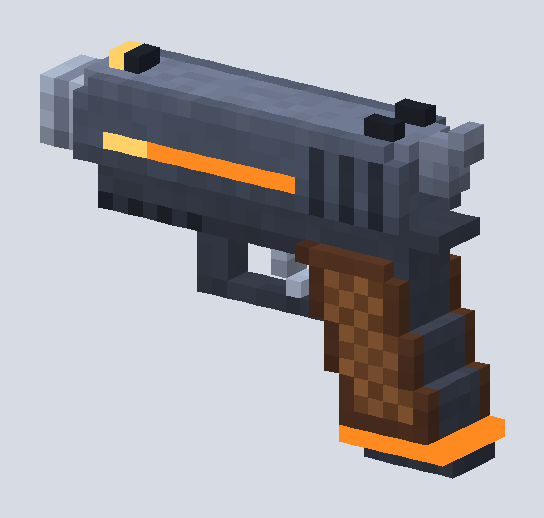
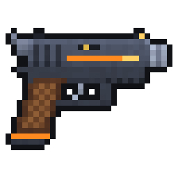

# Spark-9: blocky pixel pistol

An original chunky pixel-style pistol (one voxel = one pixel): gunmetal slide with an orange energy stripe,
chunky barrel shroud, checkered brown grip and a glowing mag plate.

  

| File | Use |
|---|---|
| `spark_pistol.obj` + `.mtl` + `spark_pistol_palette.png` | Game mesh (Unity, Godot, Unreal, Roblox Studio, Blender). 894 quads. |
| `spark_pistol.vox` | Editable source. Open in MagicaVoxel (free) to change the design. |
| `spark_pistol_icon.png` | 32x32 sprite for inventory/HUD. |
| `gen_spark_pistol.py` | Rebuilds everything (`pip install numpy pillow`). |

Import notes:
- Set the texture's filter to **Point / Nearest**, or the pixels go blurry.
- Y is up, the barrel points along **+X**, and about 0.25 units long. The origin sits inside the grip where
  the hand closes, so you can parent it straight to a hand bone. Rotate it in the engine if your forward
  axis is different.
