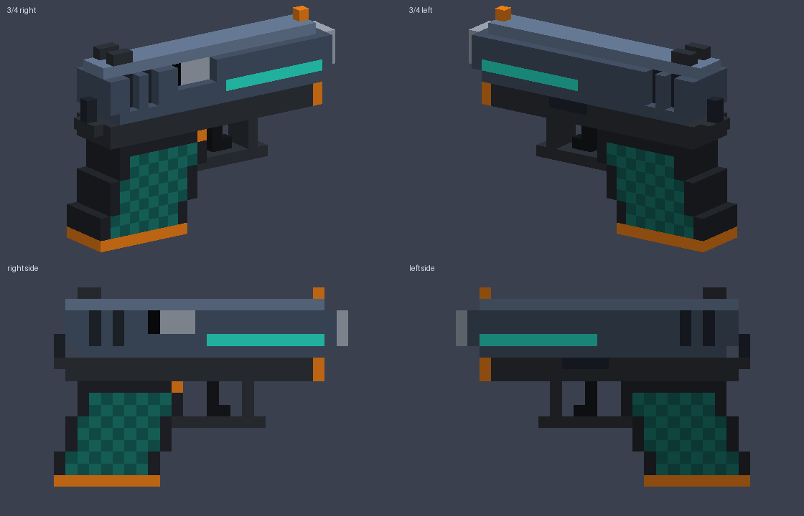

# VX-9 Pocketbrick: voxel pistol

An original, blocky sidearm built for a Pixel Gun 3D-style mod. It's 25 × 17 × 5 voxels: a gunmetal slide with a
bevelled top, a teal glow strip, a squared trigger guard with a forward hook, a raked grip with teal checker panels,
and orange accents on the front sight, frame tips, magazine release and base plate.

| File | Use |
|---|---|
| `vx9_pistol.vox` | MagicaVoxel source. Open it to recolour or edit by hand |
| `vx9_pistol.obj` + `.mtl` + `vx9_palette.png` | Game-ready mesh: 278 quads / 556 tris, one material |
| `build_pistol.py` | Generates everything above. Edit `build()` or `PALETTE` and run `python3 build_pistol.py` (needs Pillow) |

## Importing

- **Orientation:** the barrel points +X, up is +Y, and the right side (ejection port) is +Z. In Unity, rotate it so the
  barrel faces the weapon's forward axis.
- **Pivot:** the origin sits in the middle of the grip. **Scale:** 1 voxel = 0.02 units. Both are constants at the top
  of the script.
- **Texture:** the `.obj` gets every colour from a 12×1 palette strip. Set the texture to **Point (no filter)** with
  compression and mipmaps **off**, or the colours will bleed into each other.
