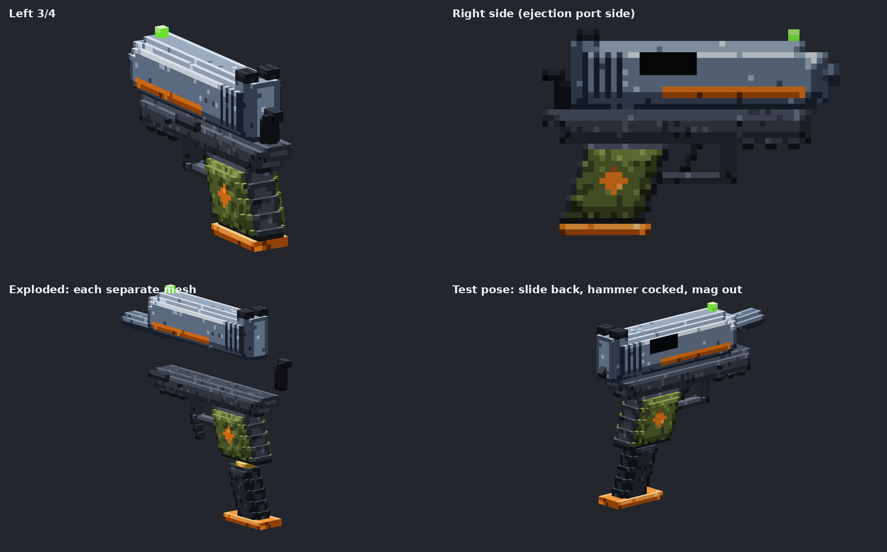

# Rotstopper: voxel pistol for Roblox

A Pixel Gun 3D / Minecraft-style voxel pistol for a zombie PvP game. It has stair-stepped bevelled
edges, a pixel-art texture with highlight and shadow rows on every face, and a noisy painted grip.
Every moving piece is a separate mesh, rigged with Motor6Ds for animation.



## Files

| File | What it is |
|---|---|
| `rotstopper.obj` + `.mtl` | The model: 8 separate meshes, ~1,100 triangles in total |
| `rotstopper_texture.png` | One 1024×512 pixel-art texture shared by all meshes |
| `rig_rotstopper.lua` | Command-bar script that turns the imported meshes into a rigged `Tool` |
| `tools/gen_rotstopper.py` | Source of truth: the pixel art and voxel settings. Edit and rerun to regenerate everything |
| `preview.png` | Renders from the generator |

## Getting it into Studio

1. **Import:** Home → Import 3D, then pick `rotstopper.obj`. Keep the pieces as separate parts (don't
   merge them into one mesh). The result is a Model holding 8 MeshParts.
2. **Texture:** if the importer applied `rotstopper_texture.png` on its own, you're done with this
   step. If not, upload the PNG (Asset Manager → Images), copy its `rbxassetid://…`, and paste it into
   `TEXTURE_ID` at the top of `rig_rotstopper.lua`.
3. **Rig:** select the imported Model in the Explorer, paste all of `rig_rotstopper.lua` into the
   command bar (View → Command Bar), and press Enter. `StarterPack.Rotstopper` appears.

The rig script finds the meshes by name, even with an importer prefix like `rotstopper_Slide`. It
measures the import's scale and position from the pieces themselves, so importing at a different
size still works. It prints a warning if the pieces aren't laid out the way the file says.

## Rig

```
Handle (invisible root, the hand holds this)
├─ Weld    Frame      static: frame, rail, beavertail, trigger guard
├─ Weld    Grip       static: grip with olive panels and orange emblem
├─ Motor6D Slide      rack: move +Z about 0.32 studs (8 voxels)
├─ Motor6D Barrel     pivot at the breech: tilt a few degrees on lock-back
├─ Motor6D Magazine   pivot axes follow the grip rake, so pulling along its -Y drops it straight out
├─ Motor6D Trigger    pivot at the top of the blade: rotate on X to pull
├─ Motor6D Hammer     pivot at the hinge: rotate on X to cock
└─ Motor6D SlideStop  lever on the left side: nudge up on an empty reload
```

Attachments for effects: `Barrel.Muzzle` (flash and raycast origin) and `Slide.ShellEject` (casings).

### Animating it with the character

Roblox only plays animation poses on tool parts when the tool is joined to the character by a
**Motor6D**, and the default `RightGrip` is a Weld. The rig adds a small `HandRig` Script that swaps
`RightGrip` for a Motor6D named `Handle` on equip. Set `ADD_HAND_RIG_SCRIPT = false` if you already
have your own system.

To keyframe the gun with the arms in the Animation Editor:

1. Parent a copy of the Tool to an R15 rig in Workspace.
2. Make a Motor6D named `Handle` in the rig's `RightHand`, with `Part0 = RightHand` and `Part1 = Tool.Handle`.

## Changing the design

All the pixel art is in `tools/gen_rotstopper.py`, written as `rect(...)` calls on a side-view grid
(row 0 at the top, columns increasing toward the muzzle). Each character in `SPEC` sets a colour
ramp, a shade, and a thickness in voxels. Run `ASCII=1 python3 tools/gen_rotstopper.py` to print
the side view as text. Colour ramps are in `RAMPS`; swap them for skins such as gold, chrome or
camo. Needs Python 3 with `numpy` and `pillow`.

## About copying

The silhouette, name, emblem and palette are original. It isn't a trace of any Pixel Gun 3D weapon.
A general voxel/pixel *style* isn't protected on its own. A specific gun's design, name, logo or
textures can be. This isn't legal advice. Use your own names and art, and don't reference PG3D in
your store listing.
